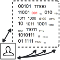

The Purpose of the Software
===========================
July 2012

 These days a different methods of architecture, design, and software development lifecycle spreading out like rabbits on the steroids. Development tools such as frameworks, components, and libraries keep up. Choice of the right methods and tools for the tasks is based on the eperience, intuition, or trial and error. With the increasing complexity of information systems, this leads to higher risks of making a wrong choice. In this article, I'd like to discuss one of the possible ways to evaluate if the choice was right.

## * The Routine

> The purpose of life is unknown. One could say it is to reduce entropy: make an order out of chaos. The purpose of the software development is to reduce routine, so life can make this entropy fighting more efficient and more fun.

Here are some thoughts on software design philosophy with more pragmatic examples at the end. <cut/>

Think of it this way: software designers hide repeatable steps and details of a particular operations behind interfaces, inside components, subroutines, modules, services, or controls. You can tell how well a particular software fits user task by how much routine steps it eliminates from the task, and how much it leaves or introduces. Also, how much knowledge about internal details the user still have to acquire to perform the task and learn about the software behind the interface to start using it and successfully resolve future issues.

Of course, overall goals of the software is wider: collect, store, and transmit information, encapsulate the knowledge about processes or calculations inside algorithms, adapt low-level control instructions to make it easily understandable for high-level programming, present information and organize process or data control to the user in an efficient and aesthetic manner etc. 

A lot of decisions here can be justified by either technical requirements
	- Do we have all the data we need?
	- Can it be compressed without losing information?
	- Is network bandwidth sufficient?
Or by design expertise
	- Are visual cues helpful?
	- Does application feel responsive?
	- Do those colors look nice next to each other?

But other decisions can be really hard to evaluate with a complete certainty.

> A very common element in software design is separating a function from its implementation. Like a lot of other things in life, it brings up 3 major questions:
	- What do we want to do?
	- How do we want to do it?
	- Why do we want it?
> What we want to achieve is the questions for function specification. How we want to do it falls into technical implementation. And finally, the understanding "why we want it" sets overall direction in wider context and guides through possible alternatives of "what" and "how".

Software design is often pretty good at answering "what" and "how" even when you get to the smallest details:
	- What opacity do you want for the button shadow?
	- How do you send these 2 bytes to the remote computer?

In contrast, the "why" question is answered on the high scope, but when it comes to details, it becomes too brain-consuming to figure out the driving force behind every small decision. Consequently, it becomes hard to tell if "small decision A" is better than "small decision B" in the context of task "C".

A choice of a tool, solution, or decision may be damaging when not-so-good choice has a chain-reaction effect. It shifts developers attention from "How to achieve the best user experience" to "How to resolve technical issues we have in this component". Project workload goes up, motivation goes down, and overall quality is stretching thin in between.

Now, is there some way to measure the quality of such choices?

Analysing routine steps can be useful here, giving a good answer to why one choice is better than the other by comparing them after separating the repetitive/boring/optional/mechanical part of the task from the creative/enjoyable/important/functional.

Spotting the routine indicates
	- Where and how the software can be improved.
	- Whether we use the right tools for the job.
	- If we can make end-users and developers be more creative.

Let's choose a few use cases and see how routine analysis can be applied to the existing solutions to improve them.

## * Saving a File in an Application X (where X = Word)

"Save a file" sounds all-technical. This is a sure giveaway that we talk about how the problem was solved, but not what we are trying to solve or why. The real task can be worded like this:
	Give my text a name and make sure I can find it later.

Now, let's check out file save dialog in MS Word. If I use Word very infrequently there will be a lot of confusion:
	- Should I fill in document title, subject, and/or tags
	- What's the difference between subject and title?
	- Did I use the right type?
	- What is that "type", what's the difference between doc, docm, docx?
	- Should I specify encoding; I remember, I had some problems with wrong encoding before
	- Where should I save it (No really, I have my articles on a shared drive, temporary and local stuff in My Documents, corporate files on a network share, project related documentation in the project folders etc)
	- Maybe I should just save the file in some temporary folder and think about all the right settings later?
	- Why the file name was copied from the text's first line while I've seen it as "Document 1" before; is there an error?

A user has to aquire some experience and start thinking "the Word's Way" here: learn to understand the technical side, figure out which parameters are important and which are safe to ignore, what values to use and which to avoid. All this effort is contributing nothing to the original activity of writing a text.

While MS Word is widely adopted, lots of Windows users still prefer different tools to author documents. One thing I've bumped into, was someone who was happy to use gmail drafts for this purpose. Gmail has basic formatting, it doesn't bother user about when and how to save the document - it does it automatically. It only asks you to enter a subject, but even that is optional, so overall, it fully eliminates all technical steps related to saving a document and makes it fully transparent to the user.

Would it be hard to make a similar implementation in a a desktop program like MS Word? Not at all:
	- Define a common place to save new documents and how to name them.
	- Name and save the document automatically and transparently to the user. 
	- Give user a function to move the documents around and give them a different name.

What's important is that now the user will be much less interrupted:
	- Naming a file is optional: user will give file a name when he/she thinks about it, not when application demands it.
	- Saving a file is transparent: user doesn't have to think in terms of when a file goes from memory to the hard drive anymore.
	- Lots of technical configuration related to the manual and auto-saving becomes obsolete, application configuration becomes more simple to the user, while software developers and testers can concentrate even more on the primary functionality.

This exercise highlights few principles of making the software more efficient:
	- Check if you make the user learn technical side of the software. That's a sign that user experience can be improved.
	- Don't ask user questions irrelevant to his work. He wouldn't care or wouldn't know what to tell you.
	- Leave user the power to make important choices, but do your best and then some to make all the choices optional. An application should perform its main function even if user decides to make the decisions later or never.

## * Rainy Day

I want to make sure that I have an umbrella when it's going to rain, so I have a weather gadget on my google page showing todays forecast. There is a number of repeatable steps here.

	1. Check my google page in the morning
	2. Click weather details link to see what hours the rain is expected
	3. Study the details and decide if I need an umbrella
	4. Remember to actually pick it up when going out

Besides taking some time and requiring a little attention, each step here is prone to errors. E.g. I might notice it was raining early morning, but now it's clear and an umbrella is no longer needed, but I'd miss that it gonna be raining again at 6pm. I can get distracted by making breakfast and won't even check weather details, or check everything, make up my mind to get an umbrella, and then totally forget about it when taking out the trash while leaving the house.

Keeping in mind that my task is literally "do not forget an umbrella when leaving a house on a rainy day". Could a different tool be used that doesn't require extra steps?

Optimal solution would be to make sure that someone who knows your plans and schedule just tells you "Honey, take your umbrella" right before you step out. OK, clearly, that's just a workaround, since you are making someone else keep all the details in mind and solve this problem for you.

The next best solution is to stick a tablet on the door and run an application that will check up-to-the-minute weather forecast and say something like: "Take an umbrella if you gonna stay outside past 7pm". This will limit the extra steps and risks to a single point of looking at the tablet and checking for the umbrella at the only moment that I really care about it - right before leaving the house.

You can increase the value of it by having other notifications on that tablet, like "You have a study group tonight. Don't forget your laptop". Make notifications more focused, e.g. run image recognition from frontal camera, detect if you are actually carrying an umbrella and make a warning sound if not. Also there are more ways to make sure that warnings are not ignored: like sound an alarm if I came next to the door and make me touch each notification on the screen before the buzz goes off or to make it extreme don't even let the door unlock.

This design exercise actually demonstrates that skipping the routine can bring you closer to the real task, making your solutions more focused on the user and more exciting.

Now, if I don't have a spare tablet to put on the door, I could either think of keeping this functionality on the desktop or moving it to a phone.

With desktop gadget there is still some extra effort to make sure I've checked it and kept the important information in mind, but knowing the ideal scenario we understand what we want much better now.
Since when looking at it, I'm most likely not yet ready to leave, desktop gadget should have a setting for when I usually leave for work, but also has to present slightly different information, like so:
	- Morning rain will stop around 7:30am
	- Take an umbrella if you don't return by 6:30pm: there is another rain tonight.

Phone application, on the other hand, has only one design problem compared to our original idea of the "door tablet": how to identify the moment when I'm going out and notify me if I need an umbrella.

There are different technical ways to do it: like detect that I've put on bluetooth headset that I don't wear at home, or show current notifications and vibrate when charger is disconnected, which usually happens in the morning when I'm ready to leave. More exotic things might include a reaction to the fading signal from my home Wi-Fi, or placing RF tag near the door. Place another RF tag on umbrella and you'll get yourself a fully automated alarm that only goes off when you will need an umbrella and actually forgot to take one.

Come to think of it, is anyone interested in writing "Get Your Umbrella" Android application?

## * String length validation or Your can not leave the country with a name like this

Here’s a more technical example related to how text strings are used in the applications.

There is a number of reasons to put a limit on a number of characters stored in database or allowed in the user interface. Lots of those reasons come from design "traditions" based on the technical limits of an ancient software, but some limitations can still be 100% legitimate even today; e.g. the number of letters you can fit on a credit card.

For historical reasons or not, a lot of development frameworks include text field validation: maximum and minimum number of characters, check for special characters, etc. This is so common that software designers are used to it and consider it a part of the regular design routine, which makes it very easy to overuse or underthink.

Lots of of database and UI development examples will demonstrate how to avoid incorrect characters in the text input fields and make sure that the text is not too short or too long. When designing a new application, it's easy to follow those examples and make similar decisions for the things like first and last name, email, and password. The truth is, those choices are based on technical reasons, which means
- The decision is not based on user task.
- The decision may be harmful.
- A software designer making those decision anyway.

There are examples of an email field not suitable to hold *firstname.lastname@company.com*, so user never gets the email from an online service, or 2-letter last name stopping a customer from accessing online banking features.

A different example is an application for US passport.

The passport application form is computer-friendly: you write each letter in it's own box, there is a clear limit for the number of characters and detailed instruction how to fill it, so overall it's very easy to prepare and submit.

The problem is that few days after all the fees are paid and the form is submitted, you might get a letter saying that you can not use your name on the travel documents.

What happened is that when submitting the form, there is a new option to ask for a passport card along with the regular passport book. The size of the card puts more strict limit on the number of letters in the name, compared to the book, so it's possible for the full name to fit on the form and in the passport book, but not on the card. There is also a rule saying that all your travel documents must have the same name. If a name can not be fit on the card, it either has to be shortened or an application has to be changed to passport book-only.

So, few days in the processing books+card application, an unlucky traveler with a long name will have to make a decision of a name change, on top of a delay in receiving the passport and a slight extra risks of missed or misplaced mail.

The perfect place to have text length validated is when the form is either submitted, or even better, filled in online. At this point, the traveler can correct any error right away and avoid all the extra steps, risks, and delays. Software designer didn't think about conditional text size check and missed an opportunity to make passport application process more straightforward for the applicant.

## * Summary

The above examples left us with a useful list of questions to see how user experience with a software can be improved.

- What is the task after all technical elements are removed?
- Are there repetitive steps in the task; can they be fully or partially automated?
- Are there technical steps every time the task is performed; can they be removed?
- Are there optional steps that user still has to pay attention to?
- Is application forcing the user to make technical decision, not related to the task?
- Is application forcing the user to make decision out of the context?
- Does user have to make a number of related decisions spread over long time?

But ultimately, it comes to this one question:

- Which part of the work is repetitive, boring, optional, or mechanical and which part is creative, enjoyable, important, or functional?

For the lack of a better word, I keep calling the first part "the routine". The routine can be either automated or avoided.

The second part is the real work - core of the user task - the important and/or creative stuff. That second part is where you need a user to do the real job, while the job of the software is to make sure to keep all the boring stuff out of it.